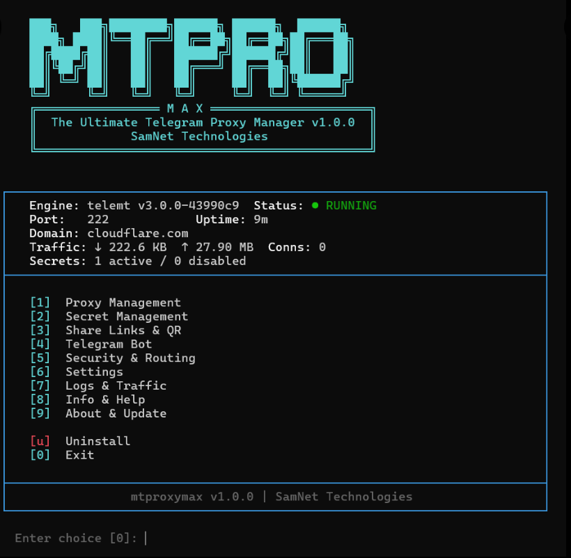

<p align="center">
  <h1 align="center">MTProxyMax</h1>
  <p align="center"><b>The Ultimate Telegram MTProto Proxy Manager</b></p>
  <p align="center">
    One script. Full control. Zero hassle.
  </p>
  <p align="center">
    <a href="#quick-start">Quick Start</a> &bull;
    <a href="#features">Features</a> &bull;
    <a href="#comparison">Comparison</a> &bull;
    <a href="#telegram-bot">Telegram Bot</a> &bull;
    <a href="#cli-reference">CLI Reference</a>
  </p>
</p>

---

MTProxyMax is a full-featured Telegram MTProto proxy manager powered by the **telemt 3.x Rust engine**. It wraps the raw proxy engine with an interactive TUI, a complete CLI, a Telegram bot for remote management, per-user access control, traffic monitoring, proxy chaining, and automatic updates — all in a single bash script.



```bash
sudo bash -c "$(curl -fsSL https://raw.githubusercontent.com/SamNet-dev/MTProxyMax/main/install.sh)"
```

## Why MTProxyMax?

Most MTProxy tools give you a proxy and a link. That's it. MTProxyMax gives you a **full management platform**:

- **Multi-user secrets** with individual bandwidth quotas, device limits, and expiry dates
- **Telegram bot** with 17 commands — manage everything from your phone
- **Interactive TUI** — no need to memorize commands, menu-driven setup
- **Prometheus metrics** — real per-user traffic stats, not just iptables guesses
- **Proxy chaining** — route through SOCKS5 upstreams for extra privacy
- **Auto-recovery** — detects downtime, restarts automatically, alerts you on Telegram
- **Pre-built Docker images** — installs in seconds, not minutes

---

## Quick Start

### One-Line Install

```bash
sudo bash -c "$(curl -fsSL https://raw.githubusercontent.com/SamNet-dev/MTProxyMax/main/install.sh)"
```

The interactive wizard walks you through everything: port, domain, first user secret, and optional Telegram bot setup.

### Manual Install

```bash
curl -fsSL https://raw.githubusercontent.com/SamNet-dev/MTProxyMax/main/mtproxymax.sh -o mtproxymax
chmod +x mtproxymax
sudo ./mtproxymax install
```

### After Install

```bash
mtproxymax menu          # Open interactive TUI
mtproxymax secret list   # See your users
mtproxymax status        # Check proxy health
```

---

## Features

### FakeTLS Obfuscation

MTProxyMax uses **FakeTLS (TLS 1.3)** by default. Your proxy traffic looks identical to normal HTTPS traffic to any network observer or DPI system. The TLS handshake SNI points to a cover domain (e.g., `cloudflare.com`), making it indistinguishable from regular web browsing.

**Traffic masking** goes further: when a non-Telegram client connects (e.g., a censor probing your server), the connection is seamlessly forwarded to the real cover domain. Your server responds exactly like cloudflare.com would — because it's actually proxying to it.

### Multi-User Secret Management

Each user gets their own **secret key** with a human-readable label. You can:

- **Add/remove** users instantly — config regenerates and proxy hot-reloads
- **Enable/disable** access without deleting the key
- **Rotate** a user's secret — new key, same label, old link stops working
- **Generate links** — both `tg://` and `https://t.me/proxy` formats
- **QR codes** — scannable directly in Telegram settings

### Per-User Access Control

Fine-grained limits enforced at the engine level:

| Limit | Description | Example |
|-------|-------------|---------|
| **Max Connections** | Simultaneous TCP connections | `100` |
| **Max IPs** | Unique devices/IPs allowed | `5` |
| **Data Quota** | Total bandwidth cap | `10G`, `500M` |
| **Expiry Date** | Auto-disable after date | `2026-12-31` |

```bash
mtproxymax secret setlimit alice 100 5 10G 2026-12-31
```

This means: Alice can use up to 100 simultaneous connections from max 5 devices, with 10GB total bandwidth, expiring Dec 31, 2026.

### User Management Recipes

#### Prevent Key Sharing

By default a secret key is unlimited — anyone who has the link can use it from any device or IP. To lock it to one person:

```bash
mtproxymax secret setlimit alice ips 1    # Alice only, no sharing possible
mtproxymax secret setlimit family ips 5   # Family of up to 5 devices
```

If someone with `ips 1` shares their link, the second IP that tries to connect gets rejected by the engine automatically.

#### IP Limit Tiers

| Scenario | `max_ips` |
|----------|-----------|
| Single person, one device | `1` |
| Single person, multiple devices | `2-3` |
| Small family | `5` |
| Small group / office | `20-30` |
| Public/open link | `0` (unlimited) |

#### Create a Time-Limited Sharing Link

```bash
# Public link: 50 simultaneous connections, 30 unique IPs, 10GB cap, expires June 1st
mtproxymax secret add shared-link
mtproxymax secret setlimits shared-link 50 30 10G 2026-06-01
```

When the expiry date hits, the link stops working automatically. No manual cleanup needed.

#### Per-Person Keys (Recommended for Control)

```bash
mtproxymax secret add alice
mtproxymax secret add bob
mtproxymax secret add charlie

# Each person gets their own link — revoke individually without affecting others
mtproxymax secret setlimit alice ips 2
mtproxymax secret setlimit bob ips 1
mtproxymax secret setlimit charlie ips 3
```

#### Temporarily Cut Someone Off

```bash
mtproxymax secret disable bob    # Bob can't connect, link preserved
mtproxymax secret enable bob     # Bob is back, same link works
```

#### Revoke a Leaked Link

```bash
mtproxymax secret rotate alice   # New key generated, old link dies immediately
```

Alice gets a new link. Anyone who had the old link is disconnected and can't reconnect.

#### Full Cleanup

```bash
mtproxymax secret remove bob     # Permanent — key gone, link dead forever
```

All other users are completely unaffected since each secret is independent.

---

### Telegram Bot (17 Commands)

Full proxy management from your phone. Setup takes 60 seconds:

```bash
mtproxymax telegram setup
```

| Command | Description |
|---------|-------------|
| `/mp_status` | Proxy status, uptime, connections |
| `/mp_secrets` | List all users with active connections |
| `/mp_link` | Get proxy links + QR code image |
| `/mp_add <label>` | Add new user, get link instantly |
| `/mp_remove <label>` | Delete user |
| `/mp_rotate <label>` | Generate new key for user |
| `/mp_enable <label>` | Re-enable disabled user |
| `/mp_disable <label>` | Temporarily disable user |
| `/mp_limits` | Show all user limits |
| `/mp_setlimit` | Set user limits |
| `/mp_traffic` | Per-user traffic breakdown |
| `/mp_upstreams` | List proxy chains |
| `/mp_health` | Run diagnostics |
| `/mp_restart` | Restart proxy |
| `/mp_update` | Check for updates |
| `/mp_help` | Show all commands |

**Automatic alerts:**
- Proxy goes down → instant Telegram notification + auto-restart attempt
- Proxy starts up → sends all active links + QR codes
- Periodic traffic reports at your chosen interval

### Proxy Chaining (Upstream Routing)

Route proxy traffic through intermediate servers to hide your IP or bypass network restrictions:

```bash
# Route 20% of traffic through Cloudflare WARP
mtproxymax upstream add warp socks5 127.0.0.1:40000 - - 20

# Route through a backup VPS
mtproxymax upstream add backup socks5 203.0.113.50:1080 user pass 80
```

Supports **SOCKS5** (with auth), **SOCKS4**, and **direct** routing with weight-based load balancing.

### Real-Time Traffic Monitoring

**Prometheus metrics** give you real per-user stats — not just iptables byte counters:

```bash
mtproxymax traffic       # Per-user breakdown
mtproxymax status        # Overview with connections count
```

Metrics include:
- Bytes uploaded/downloaded per user
- Active connections per user
- Total traffic with cumulative tracking across restarts

### Geo-Blocking

Block entire countries from accessing your proxy:

```bash
mtproxymax geoblock add ir    # Block Iran
mtproxymax geoblock add cn    # Block China
mtproxymax geoblock list      # See blocked countries
```

Uses IP-level CIDR blocklists enforced via iptables — traffic is dropped before it reaches the proxy.

### Ad-Tag Monetization

Pin a promoted channel in your users' Telegram chat list:

```bash
mtproxymax adtag set <hex_from_MTProxyBot>
```

Get your ad-tag from [@MTProxyBot](https://t.me/MTProxyBot) on Telegram. Users see a pinned channel — you earn from the proxy.

### Engine Management

MTProxyMax builds telemt from source, pinned to a known-good commit. You control exactly what version runs:

```bash
mtproxymax engine status              # Current version + available updates
mtproxymax engine latest              # Update to newest commit
mtproxymax engine switch abc1234      # Pin to specific commit
mtproxymax rebuild                    # Force rebuild from source
```

Pre-built multi-arch Docker images (amd64 + arm64) are pulled automatically. Source compilation is the automatic fallback.

### Interactive TUI

Run `mtproxymax menu` for a full terminal UI:

```
╔═══════════════════════════════════════╗
║          MTProxyMax Manager           ║
╠═══════════════════════════════════════╣
║  [1] Proxy Status                    ║
║  [2] Secrets Management              ║
║  [3] Security & Routing              ║
║  [4] Traffic & Logs                  ║
║  [5] Telegram Bot                    ║
║  [6] Settings                        ║
║  [7] Engine Management               ║
║  [8] Info & Help                     ║
║  [9] Advanced Tools                  ║
║  [0] Exit                            ║
╚═══════════════════════════════════════╝
```

Every feature is accessible through the menu. Built-in help pages explain FakeTLS, traffic masking, proxy chaining, user limits, and more.

---

## Comparison

### MTProxyMax vs Other MTProxy Solutions

| Feature | **MTProxyMax** | **mtg v2** (Go) | **Official MTProxy** (C) | **Bash Installers** |
|---------|:-:|:-:|:-:|:-:|
| **Engine** | telemt 3.x (Rust) | mtg (Go) | MTProxy (C) | Various |
| **FakeTLS** | Yes | Yes | No (needs patches) | Varies |
| **Traffic Masking** | Yes | Yes | No | No |
| **Multi-User Secrets** | Yes (unlimited) | No (1 secret) | Multi-secret | Usually 1 |
| **Per-User Limits** | Yes (conns, IPs, quota, expiry) | No | No | No |
| **Per-User Traffic Stats** | Yes (Prometheus) | No | No | No |
| **Telegram Bot** | Yes (17 commands) | No | No | No |
| **Interactive TUI** | Yes (full menus) | No | No | No |
| **Proxy Chaining** | Yes (SOCKS5/4, weighted) | Yes (SOCKS5) | No | No |
| **Geo-Blocking** | Yes | IP allowlist/blocklist | No | No |
| **Ad-Tag Support** | Yes | No (removed in v2) | Yes | Varies |
| **QR Code Generation** | Yes | No | No | Some |
| **Auto-Recovery** | Yes (with alerts) | No | No | No |
| **Prometheus Metrics** | Yes (built-in) | Yes | No | No |
| **Auto-Update** | Yes (with rollback) | No | No | No |
| **Health Diagnostics** | Yes | No | No | No |
| **Docker** | Yes (multi-arch) | Yes | No (manual) | Varies |
| **CLI + TUI** | Both | CLI only | CLI only | CLI only |
| **User Expiry Dates** | Yes | No | No | No |
| **Bandwidth Quotas** | Yes | No | No | No |
| **Device Limits** | Yes | No | No | No |
| **Active Development** | Yes | Yes | Abandoned | Varies |

### Why Not mtg?

[mtg](https://github.com/9seconds/mtg) is a solid, minimal proxy — and that's by design. It's **"highly opinionated"** and intentionally barebones. If you want a fire-and-forget single-user proxy, mtg is fine.

But mtg v2:
- **Dropped ad-tag support** entirely (v1 has it, but v1 is in maintenance-only mode)
- **Only supports one secret** — no multi-user management
- **No user limits** — can't restrict bandwidth, devices, or set expiry dates
- **No management interface** — no TUI, no Telegram bot, no traffic breakdown per user
- **No auto-recovery** — if it goes down, you won't know until users complain

### Why Not the Official MTProxy?

[Telegram's official MTProxy](https://github.com/TelegramMessenger/MTProxy) (C implementation) was **last updated in 2019** and is effectively abandoned:
- No FakeTLS support (requires community patches)
- No traffic masking
- No per-user controls
- Manual compilation, no Docker support
- No monitoring or management tools

### Why Not a Simple Bash Installer?

Scripts like [MTProtoProxyInstaller](https://github.com/HirbodBehnam/MTProtoProxyInstaller) are simple wrappers: they install a proxy and give you a link. That's it. No user management, no monitoring, no bot, no updates, no recovery.

MTProxyMax is not just an installer — it's a **management platform** that happens to install itself.

---

## Architecture

```
Telegram Client
      │
      ▼
┌─────────────────────────┐
│  Your Server (port 443) │
│  ┌───────────────────┐  │
│  │  Docker Container  │  │
│  │  ┌─────────────┐  │  │
│  │  │   telemt     │  │  │  ← Rust/Tokio engine
│  │  │  (FakeTLS)   │  │  │
│  │  └──────┬──────┘  │  │
│  └─────────┼─────────┘  │
│            │             │
│     ┌──────┴──────┐     │
│     ▼             ▼     │
│  Direct      SOCKS5     │  ← Upstream routing
│  routing     chaining   │
└─────────┬───────────────┘
          │
          ▼
   Telegram Servers
```

**Components:**
- **mtproxymax.sh** — Single bash script: CLI dispatcher, TUI renderer, config manager
- **telemt** — Rust MTProto engine running inside Docker (handles all proxy traffic)
- **Telegram bot service** — Independent systemd service polling Telegram Bot API
- **Prometheus endpoint** — telemt exposes `/metrics` on port 9090 (localhost only)

**Data flow:**
- User commands → bash script → regenerates TOML config → restarts container
- Traffic stats → Prometheus `/metrics` → parsed by script → displayed in TUI/CLI/Telegram
- Telegram bot commands → polling service → executes mtproxymax CLI → returns result

---

## CLI Reference

### Proxy Management

```bash
mtproxymax install              # Run installation wizard
mtproxymax uninstall            # Remove everything
mtproxymax start                # Start proxy
mtproxymax stop                 # Stop proxy
mtproxymax restart              # Restart proxy
mtproxymax status               # Show proxy status
mtproxymax menu                 # Open interactive TUI
```

### User Secrets

```bash
mtproxymax secret add <label>           # Add user
mtproxymax secret remove <label>        # Remove user
mtproxymax secret list                  # List all users
mtproxymax secret rotate <label>        # New key, same label
mtproxymax secret enable <label>        # Re-enable user
mtproxymax secret disable <label>       # Temporarily disable
mtproxymax secret link [label]          # Show proxy link
mtproxymax secret qr [label]            # Show QR code
mtproxymax secret setlimit <label> <type> <value>  # Set individual limit
mtproxymax secret setlimits <label> <conns> <ips> <quota> [expires]  # Set all limits
```

### Configuration

```bash
mtproxymax port [get|<number>]          # Get/set proxy port
mtproxymax domain [get|clear|<host>]    # Get/set FakeTLS domain
mtproxymax adtag set <hex>              # Set ad-tag
mtproxymax adtag remove                 # Remove ad-tag
```

### Security

```bash
mtproxymax geoblock add <CC>            # Block country
mtproxymax geoblock remove <CC>         # Unblock country
mtproxymax geoblock list                # List blocked countries
```

### Upstream Routing

```bash
mtproxymax upstream list                # List upstreams
mtproxymax upstream add <name> <type> <addr> [user] [pass] [weight]
mtproxymax upstream remove <name>       # Remove upstream
mtproxymax upstream enable <name>       # Enable upstream
mtproxymax upstream disable <name>      # Disable upstream
mtproxymax upstream test <name>         # Test connectivity
```

### Monitoring

```bash
mtproxymax traffic                      # Per-user traffic breakdown
mtproxymax logs                         # Stream live logs
mtproxymax health                       # Run diagnostics
```

### Engine & Updates

```bash
mtproxymax engine status                # Show version + check updates
mtproxymax engine latest                # Update to latest commit
mtproxymax engine switch <commit>       # Switch to specific commit
mtproxymax rebuild                      # Force rebuild from source
mtproxymax update                       # Check for script updates
mtproxymax version                      # Show version info
```

### Telegram Bot

```bash
mtproxymax telegram setup               # Interactive bot setup
mtproxymax telegram status              # Show bot status
mtproxymax telegram test                # Send test message
mtproxymax telegram disable             # Disable bot
mtproxymax telegram remove              # Remove bot completely
```

---

## System Requirements

- **OS:** Ubuntu, Debian, CentOS, RHEL, Fedora, Rocky, AlmaLinux, Alpine
- **Docker:** Auto-installed if not present
- **RAM:** 256MB minimum (configurable)
- **Access:** Root required
- **Bash:** 4.2+

---

## Configuration Files

| File | Purpose |
|------|---------|
| `/opt/mtproxymax/settings.conf` | Proxy settings (port, domain, limits) |
| `/opt/mtproxymax/secrets.conf` | User keys, limits, expiry dates |
| `/opt/mtproxymax/upstreams.conf` | Upstream routing rules |
| `/opt/mtproxymax/mtproxy/config.toml` | Generated telemt engine config |

---

## Credits

MTProxyMax is built on top of **[telemt](https://github.com/telemt/telemt)** — a high-performance MTProto proxy engine written in Rust/Tokio. All proxy protocol handling, FakeTLS, traffic masking, and per-user enforcement is powered by telemt. Credit and thanks to the telemt authors for building and maintaining the engine.

---

## License

MIT License - see [LICENSE](LICENSE) for details.

Copyright (c) 2026 SamNet Technologies
